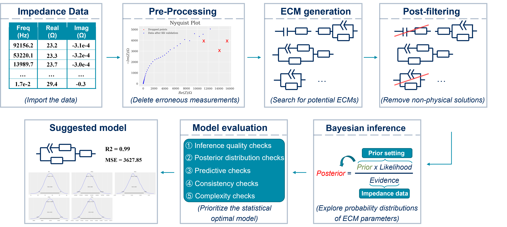

# AutoEIS
AutoEIS is a Python package that automatically proposes statistically plausible equivalent circuit models (ECMs) for electrochemical impedance spectroscopy (EIS) analysis. The package is designed for researchers and practitioners in the fields of electrochemical analysis, including but not limited to explorations of electrocatalysis, battery design, and investigations of material degradation.

Please be aware that the current version is still under development and has not been formally released. If you find any bugs or have any suggestions, please file an [issue](https://github.com/AUTODIAL/AutoEIS/issues) or directly submit a [pull request](https://github.com/AUTODIAL/AutoEIS/pulls). We would greatly appreciate any contributions from the community.

## Installation
The easiest way to install this package is using pip install from [pypi](https://pypi.org/project/autoeis/):

```bash
pip install autoeis
```

## Dependencies
The circuits generation is realized based on the julia package [EquivalentCircuits.jl](https://github.com/MaximeVH/EquivalentCircuits.jl) designed by MaximeVH. It requires a installation of [Julia programming language](https://julialang.org/).

AutoEIS depends on the following libraries:
**Python programming language (>=3.7, <3.11)**
- NumPy (>=1.20)
- Matplotlib (>=3.3)
- Pandas (>=1.1)
- impedance (>=1.4)
- regex (>=2.2)
- arviz (>=2.2.1)
- numpyro (=0.10.1)
- dill (>=0.3.4)
- PyJulia (>=0.5.7)
- IPython (>=7.19.0)
- jax (>=0.3.9)

*Note*: If your operating system is Windows, after installing `jax`, you will also need to install `jaxlib`. However, the installation of `jaxlib` on Windows is not supported via PyPI. You may need to visit [this](https://github.com/cloudhan/jax-windows-builder) repository to find the version corresponding to your Python version and then install it using a wheel.

**Julia programming language (>=1.7.0)**
- equivalentcircuit (>=0.1.3)
- CSV
- DataFrame
- Pandas
- PyCall
- DelimitedFiles
- StringEncodings

## Workflow
The schematic workflow of AutoEis is shown below:

It includes: data pre-processing, ECM generation, circuit post-filtering, Bayesian inference, and the model evaluation process. Through this workflow, AutoEis can prioritize the statistically optimal ECM and also retain suboptimal models with lower priority for subsequent expert inspection. A detailed workflow can be found in the [paper](https://iopscience.iop.org/article/10.1149/1945-7111/aceab2/meta).

## Usage
To enable interaction between Python and Julia, you must first set the Julia executable path. The default location of the Julia executable varies depending on the operating system you are using. Below are the common default locations for each supported OS:

- Windows: `C:\Users\<username>\AppData\Local\Julia-<version>\bin`
- macOS: `/Applications/Julia-<version>.app/Contents/Resources/julia/bin`
- Linux: `/usr/local/julia-<version>/bin`

Please note that `<version>` refers to the specific version of Julia you have installed, and `<username>` is the name of the current user on Windows. To confirm the location of your Julia executable path, you can open a command prompt or terminal and enter the command `which julia` (for Unix-based systems) or `where julia` (for Windows). This will display the full path of the Julia executable file.

```python
import AutoEis as ae
j = ae.set_julia(r"D:\Julia-1.7.2\bin\julia.exe")
```

Then by calling the function `initialize_julia()`, AutoEIS will automatically install Julia's dependencies. This step is only required the first time you use AutoEIS.

```python
ae.initialize_julia()
```

Now, you're all set. You can load your data and perform all the analyses using just one function:

```python
# Modify default parameters to make nicer plots
ae.set_parameter()

# Load the EIS data
data_path = "test_data.txt"
df = ae.load_data(data_path)
frequencies = ...
reals = ...
imags = ...
measurements = reals + 1j*imags

# Perform automated ECM generation and evaluation
ae.EIS_auto(
    impedance=measurements,
    freq=frequencies,
    data_path=data_path,
    iter_number=100,
    plot_ECM=False
)
```

- `impedance` : the measured electrochemical impedance
- `freq`: the measured frequencies
- `data_path`: the pathway of loaded data (this path will be used for the results storage)
- `iter_number`: the numbers of ECM generation to be performed (default = 100)
- `plot_ECM`: to plot ECM or not (*Note: To enable this parameter, a [LaTex compiler](https://www.latex-project.org/get/) is required.*) 
  
An example that demonstrate how to use AutoEIS can be found [here](https://github.com/AUTODIAL/AutoEIS/blob/main/example.ipynb). 

# Work in progress
- The graphical user interface for a more friendly interaction is under development. Please be patient :)
- Also the codes is still a bit rough for the current moment, but it is under constant improvement. Any feedback/suggestions would be greatly appreciated!

# Acknowledgement
The authors extend their heartfelt gratitude to the following individuals for their invaluable guidance and support throughout the development of this work:

- Prof. Jason Hattrick-Simpers
- Dr. Robert Black
- Dr. Debashish Sur
- Dr. Parisa Karimi
- Dr. Brian DeCost
- Dr. Kangming Li
- Prof. John R. Scully

The authors also wish to express their sincere appreciation to the following experts for engaging in technical discussions and providing valuable feedback:

- Dr. Shijing Sun
- Prof. Keryn Lian
- Dr. Alvin Virya
- Dr. Austin McDannald
- Dr. Fuzhan Rahmanian
- Prof.Helge Stein
  
Special thanks go to Prof. John R. Scully and Dr. Debashish Sur for graciously allowing us to utilize their corrosion data as an illustrative example to showcase the functionality of AutoEIS. Their contributions have been immensely helpful in shaping this research, and their unwavering support is deeply appreciated.
