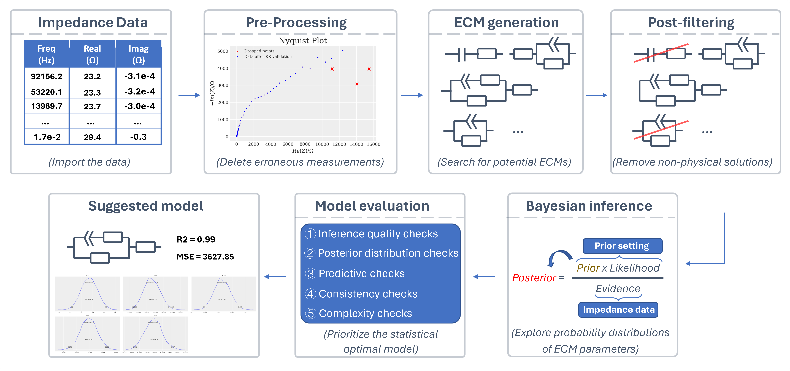

# AutoEIS
## What is AutoEIS?
AutoEIS is a Python package that automatically proposes statistically plausible equivalent circuit models (ECMs) for electrochemical impedance spectroscopy (EIS) analysis. The package is designed for researchers and practitioners in the fields of electrochemical analysis, including but not limited to explorations of electrocatalysis, battery design, and investigations of material degradation.

Please be aware that the current version is still under development and has not been formally released. If you find any bugs or have any suggestions, please file an [issue](https://github.com/AUTODIAL/AutoEIS/issues) or directly submit a [pull request](https://github.com/AUTODIAL/AutoEIS/pulls). We would greatly appreciate any contributions from the community.

## Installation
The easiest way to install this package is using pip install from [pypi](https://pypi.org/project/autoeis/):

1. [Insall Julia](https://github.com/JuliaLang/juliaup)
The official way (other than directly downloading binaries) to install Julia is through [juliaup](https://github.com/JuliaLang/juliaup). It provides an automated command line interface to install Julia and manage Julia installations on macOS, Windows, and Linux. Please follow the instructions on [juliaup](https://github.com/JuliaLang/juliaup) repository.

2. Install AutoEIS using [pip](https://pypi.org/project/autoeis)
```bash
pip install -U autoeis
```

3. Install Julia dependencies
```bash
python -c "from autoeis.julia_helpers import install; install()"
```

## Dependencies
### Julia
The circuits generation is done using the Julia package [EquivalentCircuits.jl](https://github.com/MaximeVH/EquivalentCircuits.jl) designed by MaximeVH. You need a working installation of Julia (see [Installation](##Installation)).

### JAX
If you're on Windows, after installing `jax`, you will also need to install `jaxlib`. However, `jaxlib` for Windows is not on PyPI. You may need to visit [this](https://github.com/cloudhan/jax-windows-builder) repository to find the version corresponding to your Python version and then install it using a wheel.

## Workflow
The schematic workflow of AutoEis is shown below:

It includes: data pre-processing, ECM generation, circuit post-filtering, Bayesian inference, and the model evaluation process. Through this workflow, AutoEis can prioritize the statistically optimal ECM and also retain suboptimal models with lower priority for subsequent expert inspection. A detailed workflow can be found in the [paper](https://iopscience.iop.org/article/10.1149/1945-7111/aceab2/meta).

## Julia manual setup
**We strongly recommend that you install Julia using juliaup (see [Installation](#Installation)).**

To enable interaction between Python and Julia, you must first set the Julia executable path. If you install Julia using juliaup (see [Installation](#Installation)), this will be automatically handled. Otherwise, the default location of the Julia executable varies depending on the operating system you are using. Below are the common default locations for each supported OS:

```shell
- Windows: C:\\Users\\<username>\\AppData\\Local\\Julia-<version>\\bin
- macOS:   /Applications/Julia-<version>.app/Contents/Resources/julia/bin
- Linux:   /usr/local/julia-<version>/bin
```

`<version>` refers to the specific version of Julia you have installed, and `<username>` is the name of the current user on Windows. To confirm the location of your Julia executable path, you can open a command prompt or terminal and enter the command `which julia` (for Unix-based systems) or `where julia` (for Windows). This will display the full path of the Julia executable file.

Once you locate the Julia executable path, you can set it in Python using the following command:

```python
from autoeis.julia_helpers import add_to_path
add_to_path("/path/to/julia/executable")
```

Note that you must do this every time you start a new Python session 🡢 Another reason to use juliaup 😎. Now, you're all set.

## Usage
To use AutoEIS, you can either perform the ECM generation and evaluation process step by step or use the `perform_full_analysis` function to perform the whole process automatically. The following is an example of how to use the `perform_full_analysis` function:

```python
import numpy as np
import autoeis as ae

# Load EIS data
fname = "assets/test_data.txt"
df = ae.io.load_eis_data(fname)
# Fetch frequency and impedance data
freq = df["freq/Hz"].to_numpy()
Re_Z = df["Re(Z)/Ohm"]).to_numpy()
Im_Z = -df["-Im(Z)/Ohm"].to_numpy()

# Perform EIS analysis
Z = Re_Z + Im_Z * 1j
results = perform_full_analysis(impedance=Z, freq=freq, iters=100)
print(results)
```

- `impedance`: Electrochemical impedance measurements
- `freq`: Frequencies corresponding to the impedance measurements
- `saveto`: Name of the folder to save the results
- `iters`: Numbers of equivalent circuit generation to be performed
- `draw_ecm`: Flag to plot equivalent circuits. (requires a [LaTeX compiler](https://www.latex-project.org/get/)) 
  
An example notebook that demonstrates how to use AutoEIS can be found [here](https://github.com/AUTODIAL/AutoEIS/blob/main/examples/demo_brief.ipynb). 

# Work in progress/known issues
- [ ] Refactor the code as it's still a bit rough and not production-ready.
- [ ] Speed up the code; Currently, it takes ~ 4 hours to generate 100 equivalent circuits (your mileage may vary depending on your hardware).
- [ ] Add proper unit/integration tests.
- [ ] Add proper documentation (API, more examples, etc.).
- [ ] Add a graphical user interface for a more user-friendly interaction.

# Acknowledgement
The authors extend their heartfelt gratitude to the following individuals for their invaluable guidance and support throughout the development of this work:

- Prof. Jason Hattrick-Simpers
- Dr. Robert Black
- Dr. Debashish Sur
- Dr. Parisa Karimi
- Dr. Brian DeCost
- Dr. Kangming Li
- Prof. John R. Scully

The authors also wish to express their sincere appreciation to the following experts for engaging in technical discussions and providing valuable feedback:

- Dr. Shijing Sun
- Prof. Keryn Lian
- Dr. Alvin Virya
- Dr. Austin McDannald
- Dr. Fuzhan Rahmanian
- Prof. Helge Stein
  
Special thanks go to Prof. John R. Scully and Dr. Debashish Sur for graciously allowing us to utilize their corrosion data as an illustrative example to showcase the functionality of AutoEIS. Their contributions have been immensely helpful in shaping this research, and their unwavering support is deeply appreciated.
